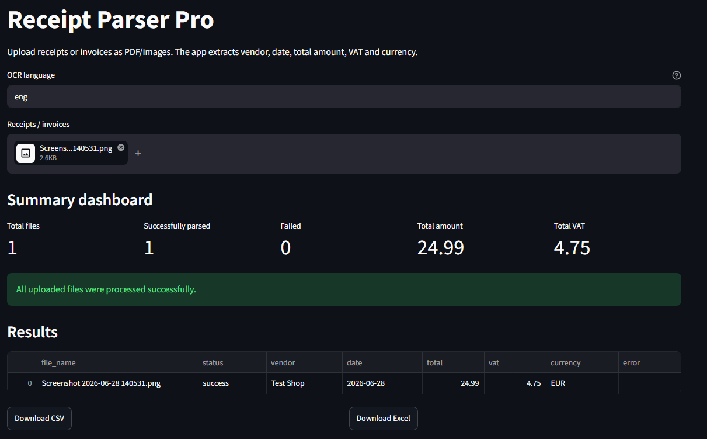
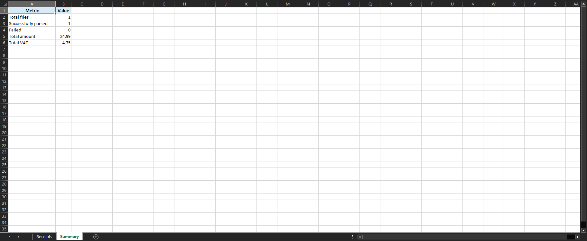

# Receipt Parser Pro

Receipt Parser Pro is a Python + Streamlit application for extracting structured data from receipts and invoices using OCR.

The app allows users to upload PDF or image files, extract key financial information, review OCR results, check parsing errors, and export the parsed data to CSV or Excel.

.png)

## Features

- Streamlit web interface
- Upload receipts and invoices as PDF or image files
- OCR processing with Tesseract
- Configurable OCR language field:
  - `eng` for English documents
  - `deu` for German documents
  - `eng+deu` for mixed English/German documents
- Extracts key receipt and invoice fields:
  - Vendor
  - Date
  - Total amount
  - VAT
  - Currency
- Summary dashboard:
  - Total files
  - Successfully parsed files
  - Failed files
  - Total amount
  - Total VAT
- Results table in the Streamlit interface
- Raw OCR text preview
- CSV export
- Excel export with two worksheets:
  - `Receipts`
  - `Summary`
- Error display for files that cannot be parsed correctly

## Use cases

Receipt Parser Pro can be useful for:

- Freelancers who want to collect receipt data for bookkeeping
- Small businesses that need a simple receipt and invoice overview
- Students or developers learning OCR-based document processing
- Python portfolio projects focused on automation and data extraction
- Prototypes for accounting, tax preparation or document management tools

## Streamlit dashboard

The Streamlit interface shows the uploaded files, parsing summary, extracted results, export buttons, errors and raw OCR text.

The dashboard includes:

- Total uploaded files
- Successfully parsed files
- Failed files
- Total amount
- Total VAT
- Results table
- CSV and Excel download buttons



## Example input

The app can parse a receipt like:

```text
Test Shop
Date: 2026-06-28
Total: 24.99 EUR
VAT: 4.75 EUR
```

Expected structured output:

| file_name | status | vendor | date | total | vat | currency |
|---|---|---|---|---:|---:|---|
| receipt.png | success | Test Shop | 2026-06-28 | 24.99 | 4.75 | EUR |

## Excel export

The Excel export creates a workbook with two worksheets:

- `Receipts`
- `Summary`

This makes the export more useful for freelancers and small businesses because users get both detailed receipt data and a compact financial overview.

### Receipts worksheet

The `Receipts` worksheet contains the detailed parsed receipt and invoice data.

It includes:

- File name
- Status
- Vendor
- Date
- Total amount
- VAT
- Currency
- Error information


### Summary worksheet

The `Summary` worksheet contains a compact financial overview.

Example:

| Metric | Value |
|---|---:|
| Total files | 1 |
| Successfully parsed | 1 |
| Failed | 0 |
| Total amount | 24.99 |
| Total VAT | 4.75 |



## Requirements

- Python 3.11 or newer
- Tesseract OCR installed locally
- Python packages from `requirements.txt`

## Installation

Clone the repository:

```bash
git clone https://github.com/maksimzvonov51-dotcom/receipt-parser-pro.git
cd receipt-parser-pro
```

Create and activate a virtual environment on Windows PowerShell:

```powershell
python -m venv .venv
.\.venv\Scripts\Activate.ps1
```

Install dependencies:

```powershell
pip install -r requirements.txt
```

## Tesseract OCR setup on Windows

Install Tesseract OCR for Windows.

If Windows does not detect `tesseract` through PATH, configure the direct path in the code, for example:

```text
C:\Program Files\Tesseract-OCR\tesseract.exe
```

The current project was tested with Tesseract OCR installed on Windows.

## Run the app

From the project folder:

```powershell
python -m streamlit run app.py
```

If the virtual environment is not activated, you can run the app directly with:

```powershell
.\.venv\Scripts\python.exe -m streamlit run app.py
```

## OCR language

Use the OCR language field in the Streamlit app.

Examples:

```text
eng
deu
eng+deu
```

For English test receipts, use:

```text
eng
```

For German receipts or invoices, use:

```text
deu
```

For mixed English/German documents, use:

```text
eng+deu
```

The required Tesseract language packs must be installed locally.

## Project structure

```text
receipt-parser-pro/
├── app.py
├── README.md
├── requirements.txt
├── LICENSE
├── .gitignore
├── assets/
│   ├── screenshot.png
│   ├── excel-receipts.png
│   └── excel-summary.png
├── receipt_parser/
│   ├── __init__.py
│   ├── cli.py
│   ├── exporter.py
│   ├── models.py
│   ├── parser.py
│   └── text_extractor.py
└── tests/
    └── test_parser.py
```

## Releases

### v0.1.0

Initial working version.

### v0.2.0

Added Excel export.

### v0.3.0

Added Summary dashboard and improved error display.

### v0.4.0

Added Excel Summary sheet with financial overview.

### v0.5.0

Improved README and project presentation for professional GitHub portfolio use.

## Roadmap

Possible next improvements:

- Better receipt and invoice parsing rules
- Support for more date and currency formats
- Improved German invoice recognition
- Multiple VAT rates
- Drag-and-drop batch processing workflow
- Export settings
- Docker support
- Streamlit Cloud deployment
- More automated tests

## Disclaimer

Receipt Parser Pro is a prototype and portfolio project. OCR and parsing results may be incomplete or incorrect depending on image quality, document layout and OCR language settings.

Always verify extracted financial data before using it for accounting, tax or business purposes.

## License

This project is licensed under the MIT License.